Steps to Run Webpage

1. Activate Virtual Environment

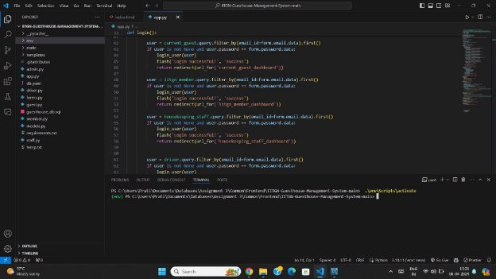

2. Install Requirements for app.py

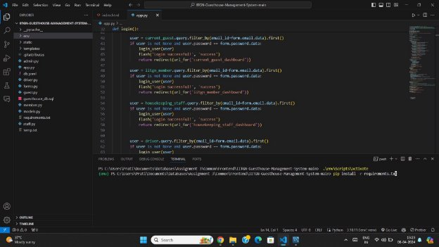

3. Run app.py, and move to link <http://127.0.0.1:5000/> on the web-page

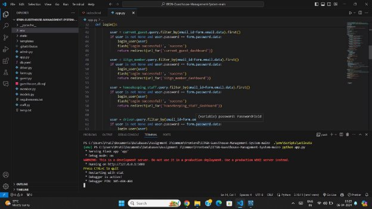

4. The Home Page of the Website is loaded

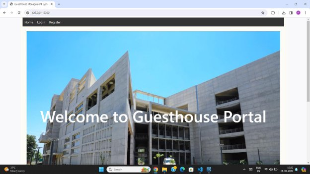

5. Move to Login window to access the portal

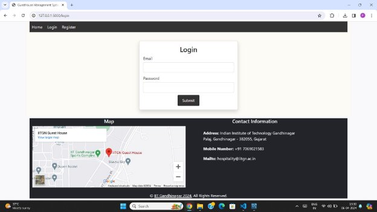

After Login, based on your login credentials you will be redirected to:

1. Hospitality Staff Portal (Admin/Stakeholder)

   (example - email: <admin1@iitgn.ac.in> & password: 123456)

2. IITGN Members Portal (User)

   (example - email: <member1@iitgn.ac.in> & password: 123456)

3. Current Guest Portal (User)

   (example - email: guest1@gmail.com & password: sC2k5&HS=9"H. )

Hospitality Staff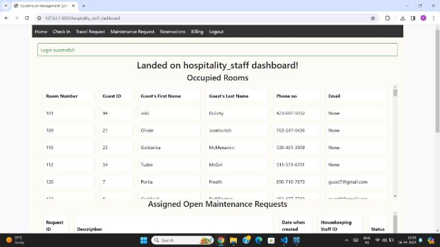

IITGN Member Dashboard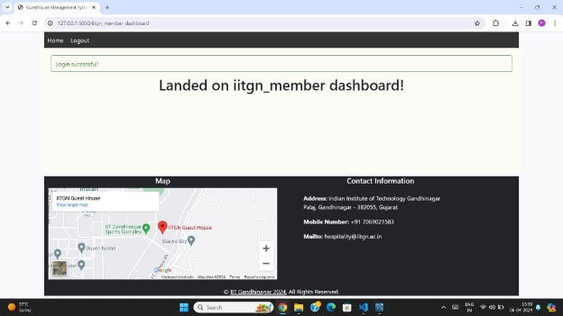

Current Guest Dashboard Screenshots of Successful execution of dynamic operations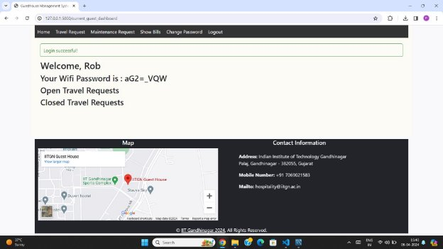

1. INSERT
1. Before Inserting Data

Data to be Inserted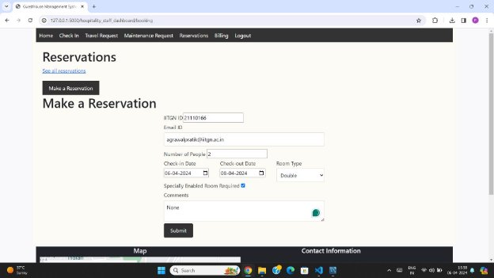

Reservation ID only upto 54 entries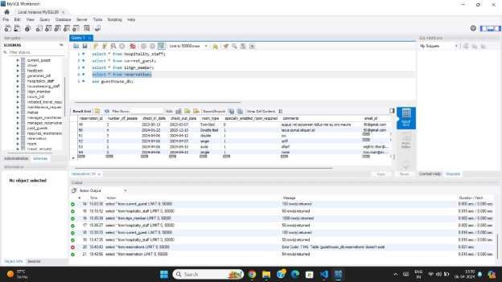

2. After Inserting Data

Reservation Successful Message with Reservation ID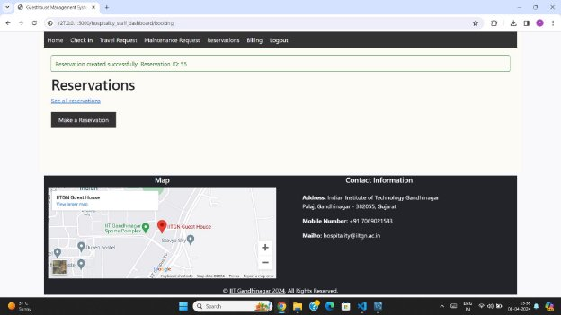

Reservation of ID 55 is added to MySQL database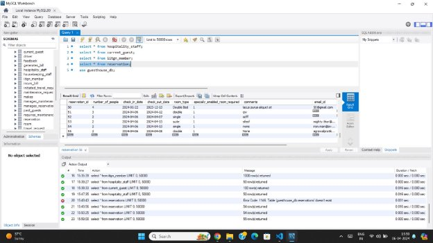

2. Update
1. Before Update

We will be updating Maintenance Request ID=23 to closed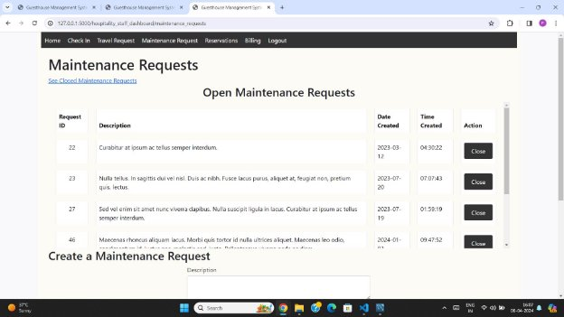

2. After Update

Pop-up Indicating Maintenance Request Closed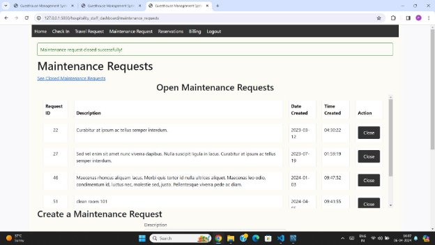

We can See Request ID=23 in Closed Maintenance Requests Section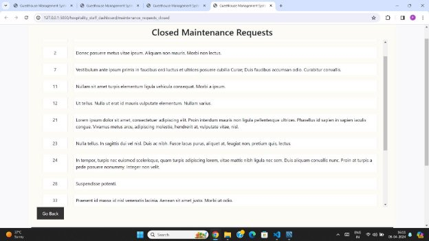

In SQL Database we can see status for Request ID=23 is updated to ‘closed’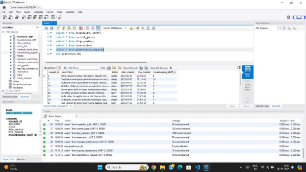

3. Delete
   1. Before Deleting
   1. After Deleting
3. Rename
1. Before Renaming Password of Guest ID=4

Window to Change Password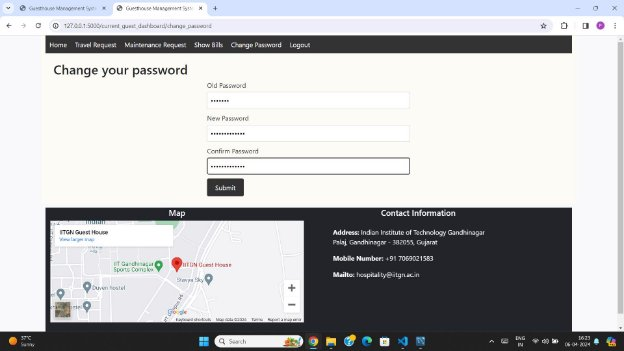

The initial Password of Guest 4 is ‘newpass’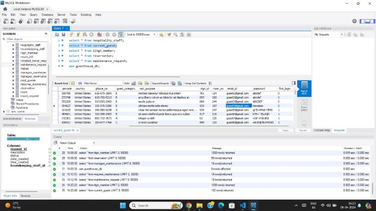

2. After Renaming Password for Guest ID=4

Pop Up indicating password change is sucessful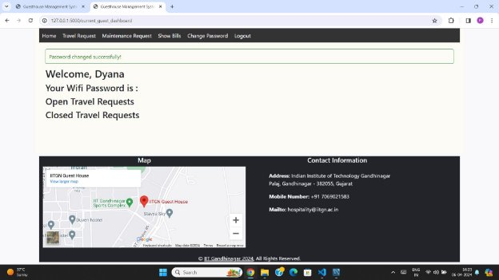

In Database, the password is renamed to ‘appleisbetter’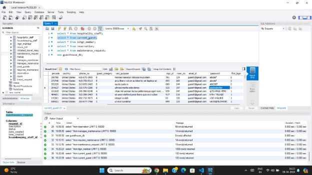

5. Where Clause
1. Before applying where clause

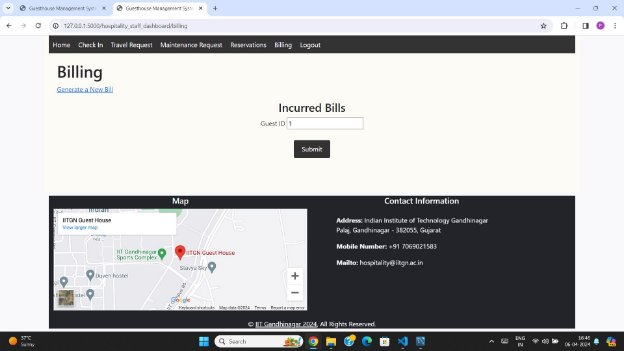

Generating Incurred Bills where Guest ID=1

2. After applying where clause
